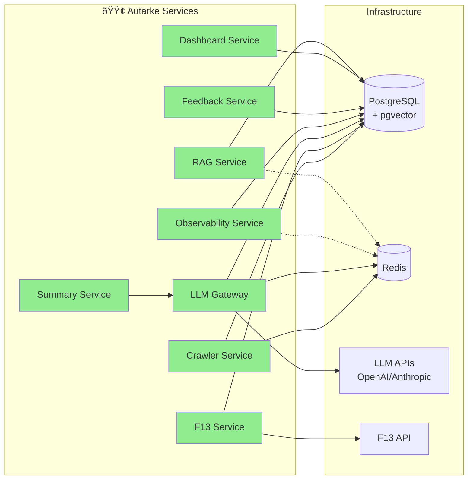
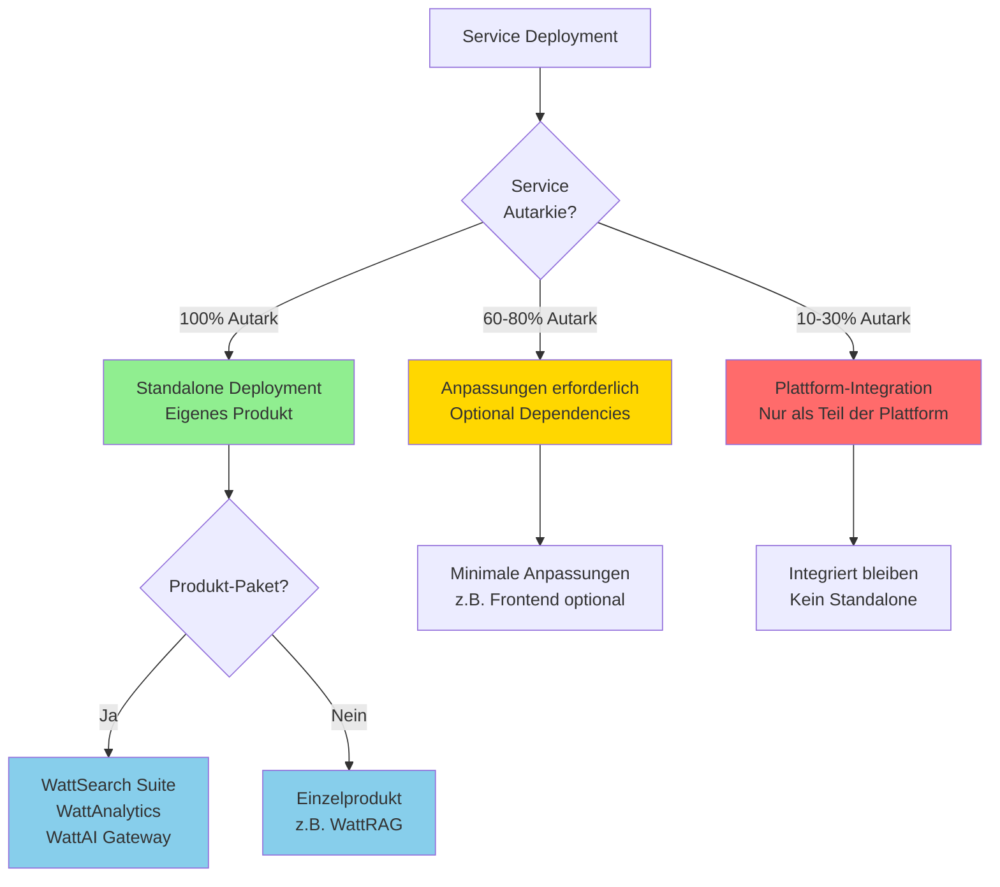

# 🏢 WattOS Plattform - Autarke Services Visualisierung

Die WattOS Plattform besteht aus modularen Services, von denen viele **autark als eigenständige Produkte** funktionieren können. Die folgende Visualisierung zeigt die Autarkie-Level und Dependencies:

## 📊 Service-Autarkie Übersicht

```mermaid
graph TB
    subgraph "🟢 Vollständig Autark (100%)"
        RAG[RAG Service<br/>WattSearch/WattRAG]
        SUMMARY[Summary Service<br/>WattSummarize]
        DASHBOARD[Dashboard Service<br/>WattDash/WattAnalytics]
        FEEDBACK[Feedback Service<br/>WattFeedback]
        OBS[Observability Service<br/>WattMonitor]
        LLM[LLM Gateway<br/>WattLLM Gateway]
        F13[F13 Service<br/>WattF13 Compliance]
        CRAWLER[Crawler Service<br/>WattCrawler]
    end
    
    subgraph "🟡 Teilweise Autark (60-80%)"
        CHAT[Chat Service<br/>WattChat<br/>70% autark]
        ADMIN[Admin Service<br/>WattAdmin<br/>80% autark]
        AVATAR[Avatar Service<br/>WattAvatar<br/>60% autark]
        VOICE[Voice Service<br/>WattVoice<br/>60% autark]
    end
    
    subgraph "🔴 Abhängig (10-30%)"
        AGENT[Agent Service<br/>30% autark]
        TOOL[Tool Service<br/>20% autark]
        CHAR[Character Service<br/>20% autark]
        CI[Customer Intelligence<br/>10% autark]
    end
    
    style RAG fill:#90EE90
    style SUMMARY fill:#90EE90
    style DASHBOARD fill:#90EE90
    style FEEDBACK fill:#90EE90
    style OBS fill:#90EE90
    style LLM fill:#90EE90
    style F13 fill:#90EE90
    style CRAWLER fill:#90EE90
    
    style CHAT fill:#FFD700
    style ADMIN fill:#FFD700
    style AVATAR fill:#FFD700
    style VOICE fill:#FFD700
    
    style AGENT fill:#FF6B6B
    style TOOL fill:#FF6B6B
    style CHAR fill:#FF6B6B
    style CI fill:#FF6B6B
```

## 🔗 Dependencies-Diagramm

Die autarken Services benötigen nur Infrastructure-Komponenten (PostgreSQL, Redis, externe APIs):

## 🔄 Service-Abhängigkeiten

Dieses Diagramm zeigt, welche Services voneinander abhängen und welche vollständig unabhängig sind:

```mermaid
graph TD
    subgraph "🟢 Autarke Services"
        RAG[RAG Service]
        SUMMARY[Summary Service]
        DASHBOARD[Dashboard Service]
        FEEDBACK[Feedback Service]
        OBS[Observability Service]
        LLM_GW[LLM Gateway]
        F13_SVC[F13 Service]
        CRAWLER[Crawler Service]
    end
    
    subgraph "🟡 Teilweise Autark"
        CHAT[Chat Service]
        ADMIN[Admin Service]
        AVATAR[Avatar Service]
        VOICE[Voice Service]
    end
    
    subgraph "🔴 Abhängige Services"
        AGENT[Agent Service]
        TOOL[Tool Service]
        CHAR[Character Service]
        CI[Customer Intelligence]
    end
    
    CHAT -.->|optional| AGENT
    AGENT --> RAG
    AGENT --> TOOL
    AGENT --> LLM_GW
    CHAR --> AGENT
    CHAR --> AVATAR
    CI --> RAG
    CI --> SUMMARY
    CI --> DASHBOARD
    
    style RAG fill:#90EE90
    style SUMMARY fill:#90EE90
    style DASHBOARD fill:#90EE90
    style FEEDBACK fill:#90EE90
    style OBS fill:#90EE90
    style LLM_GW fill:#90EE90
    style F13_SVC fill:#90EE90
    style CRAWLER fill:#90EE90
    
    style CHAT fill:#FFD700
    style ADMIN fill:#FFD700
    style AVATAR fill:#FFD700
    style VOICE fill:#FFD700
    
    style AGENT fill:#FF6B6B
    style TOOL fill:#FF6B6B
    style CHAR fill:#FF6B6B
    style CI fill:#FF6B6B
```

## 📦 Produkt-Pakete

Die folgenden Service-Kombinationen können als Produkt-Pakete verkauft werden:

```mermaid
graph TB
    subgraph "📦 Paket 1: WattSearch Suite"
        P1_RAG[RAG Service]
        P1_SUMMARY[Summary Service]
        P1_CRAWLER[Crawler Service]
        P1_RAG --> P1_SUMMARY
        P1_CRAWLER --> P1_RAG
    end
    
    subgraph "📦 Paket 2: WattAnalytics Platform"
        P2_DASH[Dashboard Service]
        P2_OBS[Observability Service]
        P2_FB[Feedback Service]
        P2_OBS --> P2_DASH
        P2_FB --> P2_DASH
    end
    
    subgraph "📦 Paket 3: WattAI Gateway"
        P3_LLM[LLM Gateway]
        P3_SUMMARY[Summary Service]
        P3_SUMMARY --> P3_LLM
    end
    
    style P1_RAG fill:#90EE90
    style P1_SUMMARY fill:#90EE90
    style P1_CRAWLER fill:#90EE90
    style P2_DASH fill:#90EE90
    style P2_OBS fill:#90EE90
    style P2_FB fill:#90EE90
    style P3_LLM fill:#90EE90
    style P3_SUMMARY fill:#90EE90
```

## 🚀 Service-Deployment-Strategie

Entscheidungsbaum für die Deployment-Strategie basierend auf dem Autarkie-Level:

## 📊 Autarkie-Matrix

| Service                    | Autarkie | Dependencies          | Produkt-Potenzial |
|----------------------------|----------|-----------------------|-------------------|
| RAG Service               | 🟢 100%  | PostgreSQL (pgvector) | ⭐⭐⭐⭐⭐         |
| Summary Service           | 🟢 100%  | LLM Gateway          | ⭐⭐⭐⭐⭐         |
| Dashboard Service         | 🟢 100%  | PostgreSQL            | ⭐⭐⭐⭐⭐         |
| Feedback Service          | 🟢 100%  | PostgreSQL            | ⭐⭐⭐⭐           |
| Observability Service     | 🟢 100%  | PostgreSQL, Redis    | ⭐⭐⭐⭐           |
| LLM Gateway               | 🟢 100%  | PostgreSQL, Redis    | ⭐⭐⭐⭐⭐         |
| F13 Service               | 🟢 100%  | PostgreSQL, F13 API  | ⭐⭐⭐⭐           |
| Crawler Service           | 🟢 100%  | PostgreSQL, Redis    | ⭐⭐⭐⭐           |
| Chat Service              | 🟡 70%   | Agent Service (opt)  | ⭐⭐⭐             |
| Admin Service             | 🟡 80%   | PostgreSQL            | ⭐⭐⭐             |
| Avatar Service            | 🟡 60%   | Frontend (opt)        | ⭐⭐⭐             |
| Voice Service             | 🟡 60%   | Frontend (opt)        | ⭐⭐⭐             |
| Agent Service             | 🔴 30%   | RAG, Tool, LLM        | ⭐                 |
| Tool Service              | 🔴 20%   | Agent Service         | ⭐                 |
| Character Service         | 🔴 20%   | Agent, Avatar         | ⭐                 |
| Customer Intelligence     | 🔴 10%   | Multiple Services     | ⭐                 |

## 💡 Produkt-Pakete Details

### 📦 Paket 1: "WattSearch Suite"
- **RAG Service** - Vector Search & Retrieval
- **Summary Service** - Content Summarization
- **Crawler Service** - Web Crawling & Content Extraction
- **Use Case:** Enterprise Search & Knowledge Management

### 📦 Paket 2: "WattAnalytics Platform"
- **Dashboard Service** - Business Intelligence Dashboards
- **Observability Service** - Application Monitoring
- **Feedback Service** - Customer Feedback Collection
- **Use Case:** Business Intelligence & Monitoring

### 📦 Paket 3: "WattAI Gateway"
- **LLM Gateway** - Multi-Provider LLM Access
- **Summary Service** - Content Processing
- **Use Case:** LLM API Management & Content Processing

---

**Stand:** 2025-01-27 | **Phase:** 6 (Testing)

**Hinweis:** Diese Diagramme werden in Markdown-Viewern mit Mermaid-Support gerendert (z.B. GitHub, GitLab, VS Code mit Mermaid Extension, Obsidian, etc.)
